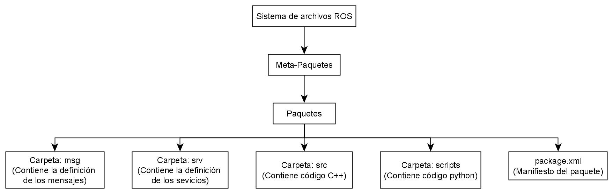

# Sistema de archivos ROS

A como se mencionó en ls introducción en la sección **¿Qué es ROS?**, ROS no es un sistema operativo pero contiene caracteristicas de uso, una de esas caracteristicas es tener un sistema de archivo. Al igual los systemas operticos Linux, Windows, Mac, etc. tiene una forma especifica de organizar la información para garantizar el correcto funcionamiento, ROS también lo que se conoce como "ROS Filesystem" o Sistema de archivos ROS, lo que define la forma en como se debe organizar la información.

## ROS Workspace

El lugar donde se almacenan todos los archivos se conoce como **ROS Workspace** 

The name catkin comes from the tail-shaped flower cluster found on willow trees -- a reference to Willow Garage where catkin was created.

## Catkin Vs rosbuild

## Referencias

- [Catkin - conceptual overview]()